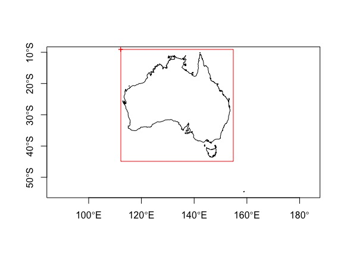

```{r setup, include=FALSE}
knitr::opts_chunk$set(echo = TRUE)
```

# Vector data in R


# Simple features


The definition of **simple features** in [wikipedia](https://en.wikipedia.org/wiki/Simple_Features).   


I highly recommed reading [the simple feature web page](https://r-spatial.github.io/sf/articles/sf1.html).

# sf package

```{r}
# install.packages("sf")
library(sf)

```

```{r message=FALSE, warning=TRUE}


```

## Coverting to sf

You can read files directly to sf or convert them from other object types (e.g. `data.frame` or `sp` objects).

Here we want to read **koala.csv** file into R and convert it to `sf` object. This file contains *longitude* and *latitude* columns that we can use to convert to `sf`.

```{r}
# reading csv file
koala <- read.csv("data/koala.csv")
head(koala) # see the first few rows

# convert to sf
koala_sf <- st_as_sf(koala, coords = c("Longitude", "Latitude"), crs = 4326)

koala_sf

plot(koala_sf)

```

Now, we can download a polygon map of Australia and plot the koalas to see where they occur in Australia!   
We can use `rworldmap` package. This packae provides the `SpatialPolygonsDataFrame` object of the world's countries. We can convert it to `sf`. For this purpose we use `dplyr` package and its *piping* functionality to simplify the code!   
Remember to load `dplyr` or `tidyverse` package.

```{r message=FALSE, warning=FALSE}
library(rworldmap)
library(tidyverse)

wmap <- rworldmap::getMap(resolution = "low")  %>% # this is SpatialPolygonDataFrame
  st_as_sf()

plot(wmap["NAME"])

# filter Australia by dplyr
australia <- wmap %>% 
  filter(NAME == "Australia")

# plot only the geomety of asutalia
plot(australia$geometry, axes = TRUE)
# add the koala points on top of it using st_geometry
plot(st_geometry(koala_sf), col = "blue", add = TRUE)

```


## Manipulating sf objects


### Cropping sf

```{r eval=FALSE}
library(raster)

# draw extent manually
ext <- drawExtent()

```



```{r echo=FALSE}
ext <- c(xmin = 111.1161,
         xmax = 157.1691,
         ymin = -45.75776,
         ymax = -8.494258 )
```

```{r message=FALSE, warning=FALSE}
australia_clip <- st_crop(australia, ext)
plot(australia_clip$geometry, axes = TRUE)
```


